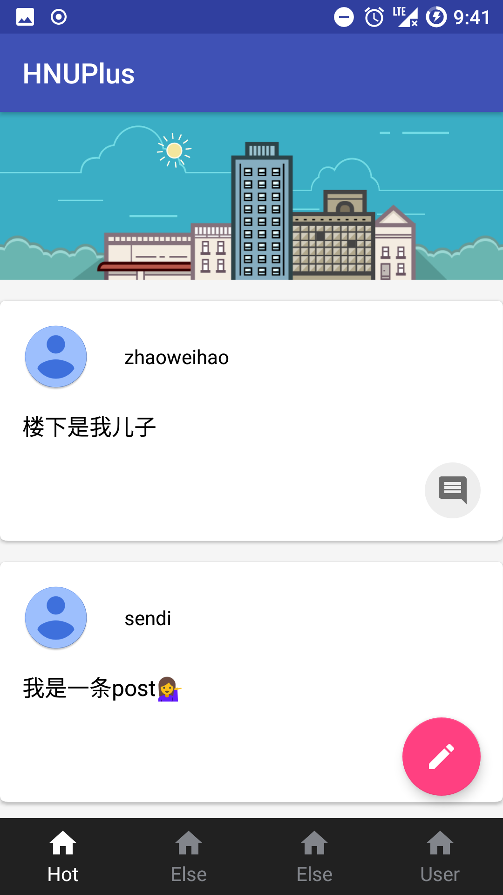

# HNUPlus
HNUPlus is a Campus Community Android application.Powered by [Bmob Cloud](https://www.bmob.cn). Before building this project, please apply the AppID and replace my AppID in `Constant.kt` with yours.

## Remind
This is still an ongoing project and does not represent the quality of the final work.
## Screenshots

|           Signup            |          Main           |          Post           |
| :-------------------------: | :---------------------: | :---------------------: |
|  |  |  |

|          User           |            Comments             |            Refresh            |
| :---------------------: | :-----------------------------: | :---------------------------: |
|  |  |  |


## APK Download

[Google Drive](https://drive.google.com/open?id=1A-q6zA-BxGhtYS5wVwmLrygzjlLzsWr6)

## Build

### Open the project in Android Studio

```

git clone https://github.com/zhaoweihaoChina/hnuplus.git

```


Open the `hunplus/` directory in Android Studio.


### Troubleshooting

+ Update the Android Studio to latest version.
+ Update the Kotlin to latest version.
+ Try to clean the project and rebuild it.
+ If none of the solutions above, file an issue or email me.

## Contact

zhaoweihaochn#foxmail.com

## Donate
[Paypal](https://www.paypal.me/zhaoweihao)

[Alipay支付宝](http://op4e089f0.bkt.clouddn.com/1512475882201.jpg)

## License

HUNPlus is under an MIT license. See the [LICENSE](LICENSE) for more information.

